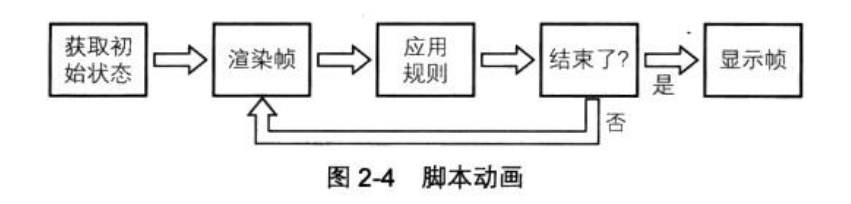

# HTML+JavaScript动画基础

## 第一部分 JavaScript动画基础 （前四章）

#### 章一、动画基本概念
##### 动画
* 运动 赋予生命
* 任意可视属性的变化。颜色，大小。
* 时间 
* 让人保持注意力。游走在不确定的边缘。

##### 帧与运动  
* 将一系列离散的图像以极快的速度连续播放从而模仿物体运动或变化。
* 连续播放一系列略有差别的图像时，大脑会将它们想象成一幅不断运动的图像。假象。
* 24帧。低于些，人眼会感觉到跳帧。

* 记录帧
    * 储存
    * 传播
    * 播放 
* 程序帧
    * 创建图片描述，根据描述创建图片。
    * 一份描述与一系列规则。
    * 计算出下一份图像。 

##### 动态与静态动画
* 静态动画。从头到尾是定义好的，每次播放都是一样的。
* 动态动画。可以有输入。交互。根据规则，产生不同的动画。 

#### 章二、动画的JavaScrit基础
#####2.1动画基础
#####2.2HTML5
#####2.3用代码实现循环
* 动画循环

    * 执行该帧所用到的代码
    * 将所有对象绘制到canvas上、
    * 重复这一过程渲染下一帧。
    * 不要用setInteval,它无法实现毫秒级的精度。、
* 使用requestAnimationFrame的动画循环。考虑兼容性。

#### 章三、动画中的三角学
事实上，用于实现基本动画的90%的三角学知识都可以归结于两个函数：Math.sin与Math.cos。

##### 3.1三角学
##### 3.2角
* 弧度和角度
    * 360°=6.2832弧度  1弧度约等于57.29°。
    * radians(弧度) = degrees*Math.PI/180
    * degrees = radians*180/Math.PI; 
    * 有些公式，你应该做到当你需要的时候能立刻在键盘上敲出来。
* canvas坐标系
    * y轴，向下为正值。
    * 顺时针的角度是正值。逆时针是负值。
* 三角形的边
* 三角函数
    * 正弦。对边与斜边的比。
        * canvas中是负值。
        * Math.sin(angle) 传入的是弧度。
    * 余弦。邻边与斜边的比。Math.cos(angle)
    * 正切。
    * 反正弦、反余弦、反正切。  根据值算出角度。Math.asin Math.acos Math.atan Math.atan2 (大概要再看看这里）)
##### 3.3旋转
* rorate
* atan2计算弧度。
    
 

